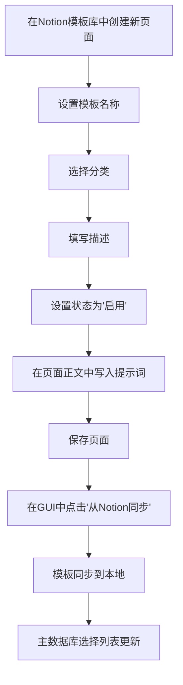
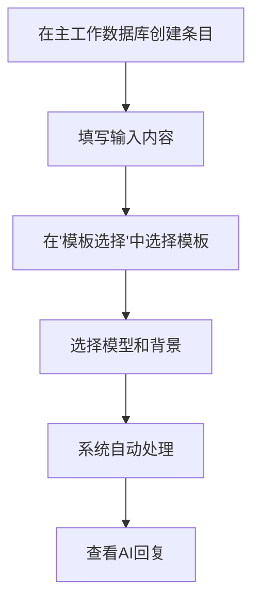

# Notion提示词模板库设计文档

> **文档创建时间**: 2025-01-28  
> **版本**: v2.2  
> **目的**: 详细记录Notion模板库管理功能的完整设计和实现

## 🎯 功能概述

### 设计理念
将**Notion作为模板管理的中心平台**，实现模板的创建、编辑、分类、状态管理等功能，通过双向同步机制确保本地和云端模板的一致性。

### 核心优势
1. **统一操作体验**: 模板管理和日常使用都在Notion中完成
2. **云端友好**: 特别适合云端部署的场景，无需本地GUI操作
3. **协作支持**: 支持团队共享和协作编辑模板
4. **版本管理**: Notion天然的版本历史功能
5. **富文本支持**: 支持格式化的提示词内容

## 🗄️ 数据库设计

### 模板库数据库结构

| 字段名称 | 字段类型 | 必需 | 默认值 | 说明 |
|---------|---------|------|-------|------|
| **模板名称** | Title | ✅ | - | 模板的唯一标识符，用于选择列表 |
| **分类** | Select | ✅ | "基础" | 模板分类，便于组织管理 |
| **描述** | Text | ⚪ | - | 模板的简短功能描述 |
| **状态** | Select | ✅ | "启用" | 控制模板是否可用 |
| **创建时间** | Created time | ⚪ | 自动 | 系统自动记录 |
| **更新时间** | Last edited time | ⚪ | 自动 | 系统自动记录 |

### 字段详细说明

#### 1. 模板名称 (Title)
- **作用**: 作为模板的唯一标识，显示在主工作数据库的选择列表中
- **命名规范**: 建议使用描述性名称，如"领导力教练"、"冷静冷静"等
- **限制**: Notion Title字段限制，通常足够长

#### 2. 分类 (Select)
- **预设选项**: 
  - `基础` - 通用模板
  - `管理` - 管理和领导相关
  - `心理` - 心理辅导和情感支持
  - `教育` - 学习和知识传递
  - `创意` - 创意写作和头脑风暴
  - `技术` - 技术问题解答
- **扩展性**: 可根据需要添加新分类

#### 3. 描述 (Text)
- **作用**: 为使用者提供模板功能的简短说明
- **建议长度**: 50-100字符
- **示例**: "用于管理层面试和团队建设的专业指导"

#### 4. 状态 (Select)
- **选项**: 
  - `启用` - 模板可用，会被同步到本地和主数据库
  - `禁用` - 模板不可用，不会出现在选择列表中
  - `测试` - 测试阶段，仅开发者可见
- **同步规则**: 只有"启用"状态的模板会被同步

#### 5. 页面内容
- **重要**: 提示词的具体内容写在**页面正文**中，不是在属性字段中
- **格式**: 支持Notion的富文本格式
- **长度**: 无严格限制，但建议控制在合理范围内

## ⚙️ 配置文件设置

### config.json 新增配置项

```json
{
  "notion": {
    // ... 原有配置保持不变 ...
    
    // 模板库数据库配置
    "template_database_id": "your_template_database_id_here",
    "template_name_property": "模板名称",
    "template_category_property": "分类", 
    "template_description_property": "描述",
    "template_status_property": "状态"
  }
}
```

### 配置参数说明

| 参数名称 | 必需 | 说明 | 示例值 |
|---------|------|------|--------|
| `template_database_id` | ✅ | 模板库数据库的ID | `f336d0bc-b841-465b-8045-024475c079dd` |
| `template_name_property` | ✅ | 模板名称字段名称 | `"模板名称"` |
| `template_category_property` | ✅ | 分类字段名称 | `"分类"` |
| `template_description_property` | ⚪ | 描述字段名称 | `"描述"` |
| `template_status_property` | ✅ | 状态字段名称 | `"状态"` |

## 🔧 代码实现细节

### 1. NotionHandler 扩展

#### 新增方法

```python
def get_templates_from_notion(self):
    """从Notion模板库数据库获取所有模板"""
    # 查询启用状态的模板
    # 按模板名称排序
    # 返回格式化的模板数据

def sync_templates_to_notion(self, templates):
    """将本地模板同步到Notion模板库"""
    # 遍历本地模板
    # 检查Notion中是否存在
    # 创建或更新Notion页面

def update_main_database_templates(self, template_names):
    """更新主数据库的模板选择列表"""
    # 获取主数据库schema
    # 更新Select字段的选项列表
```

#### API调用详情

**获取模板库数据**:
```http
POST https://api.notion.com/v1/databases/{template_database_id}/query
Content-Type: application/json
Authorization: Bearer {notion_api_key}

{
  "filter": {
    "property": "状态",
    "select": {
      "equals": "启用"
    }
  },
  "sorts": [
    {
      "property": "模板名称",
      "direction": "ascending"
    }
  ]
}
```

**获取页面内容**:
```http
GET https://api.notion.com/v1/blocks/{page_id}/children
Authorization: Bearer {notion_api_key}
```

### 2. TemplateManager 扩展

#### 新增方法

```python
def sync_from_notion(self):
    """从Notion同步模板到本地"""
    # 调用NotionHandler获取模板
    # 更新本地templates.json
    # 更新分类列表
    # 返回操作结果

def sync_to_notion(self):
    """同步本地模板到Notion"""
    # 读取本地模板
    # 调用NotionHandler创建/更新
    # 同步模板选择列表到主数据库
    # 返回操作结果
```

#### 数据转换

**Notion → Local**:
```python
notion_template = {
    "name": page["properties"]["模板名称"]["title"][0]["text"]["content"],
    "category": page["properties"]["分类"]["select"]["name"],
    "description": page["properties"]["描述"]["rich_text"][0]["text"]["content"],
    "status": page["properties"]["状态"]["select"]["name"],
    "content": extracted_page_content
}

local_template = {
    "category": notion_template["category"],
    "prompt": notion_template["content"],
    "description": notion_template["description"]
}
```

### 3. GUI 界面集成

#### 新增按钮和功能

```python
# 模板库页面新增同步按钮
ttk.Button(row3, text="📥 从Notion同步", command=self.sync_from_notion)
ttk.Button(row3, text="📤 同步到Notion", command=self.sync_to_notion)

def sync_from_notion(self):
    """从Notion同步模板（异步执行）"""
    
def sync_to_notion(self):
    """同步模板到Notion（异步执行）"""
```

#### 用户交互流程

1. 用户点击同步按钮
2. 显示进度提示
3. 后台执行同步操作
4. 刷新模板列表显示
5. 显示操作结果消息

## 🔄 工作流程

### 模板创建流程



### 模板使用流程



### 双向同步机制

#### 从Notion同步到本地
1. 查询Notion模板库（只获取启用状态）
2. 提取页面内容和属性
3. 转换为本地格式
4. 更新templates.json文件
5. 刷新GUI显示
6. 同步模板选择列表到主数据库

#### 从本地同步到Notion
1. 读取本地templates.json
2. 遍历每个模板
3. 检查Notion中是否存在同名模板
4. 创建新页面或更新现有页面
5. 设置页面属性和内容
6. 更新主数据库的模板选择列表

## 🛠️ API接口设计

### 主要API方法

#### NotionHandler.get_templates_from_notion()
```python
返回格式:
{
    "模板名称1": {
        "category": "管理",
        "prompt": "具体的提示词内容...",
        "description": "模板描述",
        "status": "启用"
    },
    "模板名称2": {
        "category": "心理", 
        "prompt": "具体的提示词内容...",
        "description": "模板描述",
        "status": "启用"
    }
}
```

#### NotionHandler.sync_templates_to_notion(templates)
```python
参数:
templates = {
    "模板名称": {
        "category": "分类",
        "prompt": "提示词内容", 
        "description": "描述"
    }
}

返回:
{
    "success": True/False,
    "message": "操作结果描述",
    "created": 3,  # 新创建的模板数量
    "updated": 1   # 更新的模板数量
}
```

#### NotionHandler.update_main_database_templates(template_names)
```python
参数:
template_names = ["模板名称1", "模板名称2", ...]

作用:
更新主数据库"模板选择"字段的选项列表
```

## 🔍 错误处理

### 常见错误和解决方案

#### 1. API权限错误
```
错误: "API token is invalid"
解决: 检查Notion API密钥是否正确，确认集成权限
```

#### 2. 数据库ID错误
```
错误: "Object not found"
解决: 验证template_database_id是否正确，确认数据库存在
```

#### 3. 字段名称不匹配
```
错误: "Property '模板名称' does not exist"
解决: 检查配置文件中的字段名称与Notion数据库实际字段名是否一致
```

#### 4. 同步冲突
```
错误: 本地和Notion模板名称冲突
解决: 实现智能冲突解决策略，如询问用户选择覆盖方式
```

### 错误处理代码示例

```python
try:
    templates = self.notion_handler.get_templates_from_notion()
    if not templates:
        return False, "从Notion获取模板失败或模板库为空"
except Exception as e:
    if "unauthorized" in str(e).lower():
        return False, "Notion API权限不足，请检查API密钥和数据库权限"
    elif "not_found" in str(e).lower():
        return False, "模板库数据库不存在，请检查database_id配置"
    else:
        return False, f"同步失败: {str(e)}"
```

## 🎯 优化建议

### 性能优化
1. **缓存机制**: 实现本地模板缓存，减少API调用
2. **增量同步**: 只同步变更的模板，而不是全量同步
3. **异步处理**: 所有同步操作都在后台线程执行
4. **批量操作**: 尽可能使用批量API减少网络请求

### 用户体验优化
1. **进度指示**: 显示同步进度和状态
2. **冲突解决**: 智能处理同名模板冲突
3. **版本对比**: 显示本地和Notion模板的差异
4. **一键恢复**: 支持从备份恢复模板

### 功能扩展
1. **模板分享**: 支持导出/导入模板文件
2. **模板统计**: 显示模板使用频率和效果
3. **版本管理**: 支持模板版本历史
4. **团队协作**: 支持多用户协作编辑

### 安全考虑
1. **数据备份**: 同步前自动备份本地模板
2. **回滚机制**: 支持操作失败时的自动回滚
3. **权限检查**: 确认API权限足够执行所有操作
4. **数据验证**: 验证同步数据的完整性和正确性

## 📝 测试用例

### 功能测试

#### 1. 基础同步测试
- [ ] 从空的Notion模板库同步到本地
- [ ] 从有数据的Notion模板库同步到本地
- [ ] 从本地同步到空的Notion模板库
- [ ] 从本地同步到有数据的Notion模板库

#### 2. 数据一致性测试
- [ ] 模板名称正确同步
- [ ] 分类信息正确同步
- [ ] 提示词内容完整同步
- [ ] 状态控制正确工作

#### 3. 错误处理测试
- [ ] API密钥错误时的处理
- [ ] 数据库ID错误时的处理
- [ ] 网络异常时的处理
- [ ] 字段名称不匹配时的处理

#### 4. 用户交互测试
- [ ] 同步按钮响应正常
- [ ] 进度提示显示正确
- [ ] 结果消息准确
- [ ] 界面刷新及时

### 压力测试
- [ ] 大量模板同步性能
- [ ] 长时间运行稳定性
- [ ] 网络不稳定情况下的表现
- [ ] 并发操作的处理

## 📊 数据结构

### 本地templates.json格式
```json
{
  "templates": {
    "领导力教练": {
      "category": "管理",
      "prompt": "你是一位经验丰富的领导力教练...",
      "description": "专业的管理和领导指导"
    },
    "冷静冷静": {
      "category": "心理",
      "prompt": "你是一位心理咨询师...",
      "description": "情绪管理和心理疏导"
    }
  },
  "categories": ["基础", "管理", "心理", "教育", "创意", "技术"]
}
```

### Notion API响应格式
```json
{
  "results": [
    {
      "id": "page-id",
      "properties": {
        "模板名称": {
          "title": [{"text": {"content": "领导力教练"}}]
        },
        "分类": {
          "select": {"name": "管理"}
        },
        "描述": {
          "rich_text": [{"text": {"content": "专业的管理指导"}}]
        },
        "状态": {
          "select": {"name": "启用"}
        }
      }
    }
  ]
}
```

## 🚀 部署说明

### 云端部署配置
- 确保云端环境包含所有必要的依赖
- 配置正确的环境变量
- 验证Notion API访问权限
- 测试模板同步功能

### 环境变量
```bash
NOTION_API_KEY=your_notion_api_key
NOTION_DATABASE_ID=your_main_database_id
NOTION_TEMPLATE_DATABASE_ID=your_template_database_id
```

---

**📝 文档说明**: 本文档详细记录了Notion模板库管理功能的完整设计和实现细节，供后续开发和优化参考。

**🔄 更新记录**: 
- 2025-01-28: 初始版本，包含完整的设计和实现说明 