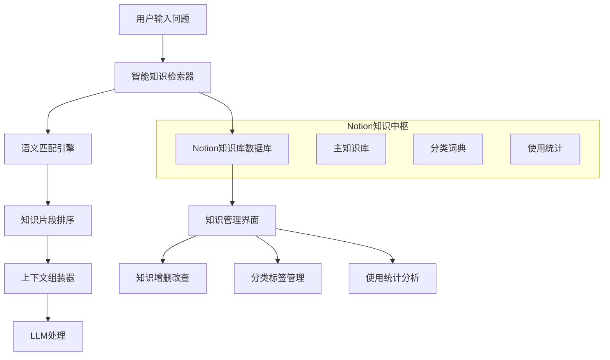

# Notion-LLM 知识库升级架构设计文档

## 📋 设计概览

**项目名称**: Notion知识库智能化升级  
**设计时间**: 2025年1月  
**目标**: 将现有"硬灌"知识库进化为基于Notion的智能知识检索系统  
**核心理念**: 从"用户选择标签"到"AI智能匹配知识"

---

## 🔍 现状分析

### 当前知识库实现方式

```python
# 当前实现：notion_handler.py 第470行
def get_context_from_knowledge_base(self, tags: list[str]) -> str:
    # 简单的文件名匹配
    for tag in tags:
        file_path = os.path.join(base_path, f"{tag}.md")
        # 读取整个文件
```

### 存在的问题

| 问题类型 | 具体表现 | 影响程度 |
|---------|---------|----------|
| **匹配精度低** | 标签名必须与文件名完全一致 | 🔴 高 |
| **检索粗糙** | 读取整个文件，无法精准定位相关片段 | 🔴 高 |
| **管理困难** | 本地文件管理，无法动态更新和分类 | 🟡 中 |
| **扩展性差** | 无法支持知识关联、版本管理等高级功能 | 🟡 中 |
| **用户体验差** | 用户需要准确记住标签名，无法模糊匹配 | 🔴 高 |

---

## 🎯 升级目标与核心价值

### 核心转变

```
旧模式: 用户选择固定标签 → 系统硬匹配文件 → 读取整个文件
新模式: 用户描述问题场景 → AI智能检索匹配 → 精准返回相关知识片段
```

### 价值提升

1. **智能化**: 从硬匹配到语义理解
2. **精准化**: 从整文件到相关片段
3. **动态化**: 从静态文件到实时管理
4. **协作化**: 从本地管理到团队共享
5. **可视化**: 从命令行到图形界面

---

## 🏗️ 总体架构设计

### 系统架构图



### 核心组件

| 组件名称 | 职责 | 技术实现 |
|---------|------|----------|
| **KnowledgeSearcher** | 智能知识检索与匹配 | Python + 语义算法 |
| **NotionKnowledgeDB** | Notion知识库操作 | NotionAPI扩展 |
| **ContextAssembler** | 知识片段组装与优化 | 文本处理算法 |
| **KnowledgeManager** | 知识库管理界面 | GUI集成 |

---

## 📊 Notion知识库数据库设计

### 主知识库数据库结构

| 字段名称 | 字段类型 | 必需 | 说明 | 示例 |
|---------|---------|------|------|------|
| **知识标题** | Title | ✅ | 知识条目的标题 | "AI效率中心部门职能介绍" |
| **知识分类** | Select | ✅ | 一级分类 | 业务知识、技术文档、流程规范 |
| **知识子类** | Select | ⚪ | 二级分类 | 部门介绍、工作流程、技术规范 |
| **关键词** | Multi-select | ✅ | 检索关键词标签 | AI效率中心、部门定位、战略使命 |
| **适用场景** | Multi-select | ⚪ | 适用的问题类型 | 部门介绍、职能咨询、业务理解 |
| **优先级** | Select | ✅ | 检索排序权重 | 高、中、低 |
| **状态** | Select | ✅ | 知识状态 | 启用、禁用、待审核 |
| **关联知识** | Relation | ⚪ | 关联到其他知识条目 | 关联相关知识 |
| **使用频率** | Number | ⚪ | 系统自动统计调用次数 | 自动更新 |
| **创建人** | People | ⚪ | 知识创建者 | 自动记录 |
| **最后更新** | Last edited time | ⚪ | 最后编辑时间 | 自动记录 |

### 页面内容结构

每个知识条目的页面内容采用结构化格式：

```markdown
# 知识摘要
[50-100字的核心摘要，用于快速匹配和预览]

## 详细内容
[完整的知识内容，支持富文本格式]

## 使用场景
- 场景1：用户询问部门职能时
- 场景2：需要了解组织架构时
- 场景3：业务合作咨询时

## 相关知识
- 参考：[其他相关知识条目]
- 延伸：[深度阅读建议]

## 更新记录
- 2025-01-20：创建初版
- 2025-01-25：补充使用场景
```

### 分类词典数据库

| 字段名称 | 字段类型 | 说明 |
|---------|---------|------|
| **分类名称** | Title | 分类的名称 |
| **分类类型** | Select | 一级分类、二级分类 |
| **父分类** | Relation | 关联到上级分类 |
| **描述** | Text | 分类的用途说明 |
| **状态** | Select | 启用、禁用 |

---

## 🔧 技术实现方案

### 1. 智能检索算法设计

#### 多层次匹配策略

```python
class KnowledgeSearcher:
    def search_knowledge(self, user_query: str, context_type: str = "auto"):
        """
        智能知识检索主入口
        """
        # 第一层：精确关键词匹配
        exact_matches = self._exact_keyword_match(user_query)
        
        # 第二层：语义相似度匹配
        semantic_matches = self._semantic_similarity_match(user_query)
        
        # 第三层：分类和场景匹配
        category_matches = self._category_scene_match(user_query, context_type)
        
        # 第四层：使用频率权重调整
        weighted_results = self._apply_usage_weights(
            exact_matches, semantic_matches, category_matches
        )
        
        # 第五层：知识片段提取
        relevant_snippets = self._extract_relevant_snippets(weighted_results, user_query)
        
        return self._assemble_context(relevant_snippets)
```

#### 关键算法实现

```python
def _semantic_similarity_match(self, query: str):
    """语义相似度计算"""
    # 使用简单但有效的TF-IDF + 余弦相似度
    from sklearn.feature_extraction.text import TfidfVectorizer
    from sklearn.metrics.pairwise import cosine_similarity
    
    # 获取所有知识条目的文本
    knowledge_texts = self._get_all_knowledge_texts()
    
    # 构建向量化器
    vectorizer = TfidfVectorizer(
        stop_words=['的', '是', '在', '了', '和', '与'],  # 中文停用词
        ngram_range=(1, 2)  # 支持1-2元组
    )
    
    # 计算相似度
    tfidf_matrix = vectorizer.fit_transform([query] + knowledge_texts)
    similarity_scores = cosine_similarity(tfidf_matrix[0:1], tfidf_matrix[1:]).flatten()
    
    return similarity_scores

def _extract_relevant_snippets(self, knowledge_items: list, query: str):
    """提取相关知识片段"""
    snippets = []
    
    for item in knowledge_items[:5]:  # 取前5个最相关的
        content = item['content']
        
        # 按段落分割
        paragraphs = content.split('\n\n')
        
        # 计算每个段落与查询的相关性
        relevant_paragraphs = []
        for para in paragraphs:
            if self._is_paragraph_relevant(para, query):
                relevant_paragraphs.append(para)
        
        # 如果找到相关段落，使用片段；否则使用摘要
        if relevant_paragraphs:
            snippet = '\n\n'.join(relevant_paragraphs[:3])  # 最多3段
        else:
            snippet = item.get('summary', content[:500])  # 使用摘要或前500字
        
        snippets.append({
            'title': item['title'],
            'content': snippet,
            'source': item['id'],
            'relevance': item['score']
        })
    
    return snippets
```

### 2. NotionAPI扩展实现

```python
class NotionKnowledgeDB(NotionHandler):
    """扩展NotionHandler以支持知识库操作"""
    
    def __init__(self, config):
        super().__init__(config)
        # 知识库数据库配置
        self.knowledge_db_id = config['notion']['knowledge_database_id']
        self.category_db_id = config['notion']['category_database_id']
    
    def search_knowledge_by_keywords(self, keywords: list):
        """根据关键词搜索知识"""
        filters = {
            "and": [
                {
                    "property": "状态",
                    "select": {"equals": "启用"}
                },
                {
                    "or": [
                        {
                            "property": "关键词",
                            "multi_select": {"contains": keyword}
                        } for keyword in keywords
                    ]
                }
            ]
        }
        
        return self._query_database(self.knowledge_db_id, filters)
    
    def get_knowledge_by_category(self, category: str, subcategory: str = None):
        """根据分类获取知识"""
        filters = {
            "and": [
                {
                    "property": "状态",
                    "select": {"equals": "启用"}
                },
                {
                    "property": "知识分类",
                    "select": {"equals": category}
                }
            ]
        }
        
        if subcategory:
            filters["and"].append({
                "property": "知识子类",
                "select": {"equals": subcategory}
            })
        
        return self._query_database(self.knowledge_db_id, filters)
    
    def update_usage_frequency(self, knowledge_id: str):
        """更新知识使用频率"""
        try:
            # 获取当前使用频率
            page = self._get_page(knowledge_id)
            current_frequency = page['properties']['使用频率']['number'] or 0
            
            # 更新使用频率
            self._update_page_property(knowledge_id, {
                "使用频率": {"number": current_frequency + 1}
            })
        except Exception as e:
            print(f"更新使用频率失败: {e}")
```

### 3. 上下文组装优化

```python
class ContextAssembler:
    """知识上下文组装器"""
    
    def __init__(self, max_context_length: int = 4000):
        self.max_context_length = max_context_length
    
    def assemble_context(self, snippets: list, query: str) -> str:
        """组装最优上下文"""
        if not snippets:
            return ""
        
        # 按相关性排序
        sorted_snippets = sorted(snippets, key=lambda x: x['relevance'], reverse=True)
        
        # 构建分层上下文
        context_parts = []
        current_length = 0
        
        # 添加查询相关的说明
        intro = f"以下是与您的问题「{query}」相关的知识库内容：\n\n"
        context_parts.append(intro)
        current_length += len(intro)
        
        # 逐个添加知识片段
        for i, snippet in enumerate(sorted_snippets):
            snippet_text = f"### {snippet['title']}\n{snippet['content']}\n\n"
            
            # 检查长度限制
            if current_length + len(snippet_text) > self.max_context_length:
                if i == 0:  # 至少包含一个片段
                    snippet_text = self._truncate_snippet(snippet_text, 
                                                        self.max_context_length - current_length)
                    context_parts.append(snippet_text)
                break
            
            context_parts.append(snippet_text)
            current_length += len(snippet_text)
        
        # 添加使用说明
        if len(sorted_snippets) > len(context_parts) - 1:
            context_parts.append("（注：由于长度限制，已显示最相关的知识片段）")
        
        return "".join(context_parts)
    
    def _truncate_snippet(self, snippet: str, max_length: int) -> str:
        """智能截断知识片段"""
        if len(snippet) <= max_length:
            return snippet
        
        # 尝试在段落边界截断
        lines = snippet.split('\n')
        truncated_lines = []
        current_length = 0
        
        for line in lines:
            if current_length + len(line) + 1 > max_length - 20:  # 保留空间给省略号
                break
            truncated_lines.append(line)
            current_length += len(line) + 1
        
        return '\n'.join(truncated_lines) + '\n\n（... 内容过长已截断）'
```

---

## 🎨 用户体验设计

### 1. 交互流程重新设计

#### 原有流程
```
1. 用户在Notion选择固定的"背景"标签
2. 系统根据标签名查找对应文件
3. 读取整个文件作为上下文
```

#### 新的流程
```
1. 用户在新增的"问题场景"字段中描述问题背景
2. 系统智能分析问题并匹配相关知识
3. 返回精准的知识片段组合
4. （可选）用户可以查看知识来源和相关推荐
```

### 2. Notion数据库界面优化

#### 主工作数据库新增字段

| 字段名称 | 字段类型 | 说明 |
|---------|---------|------|
| **问题场景** | Text | 用户描述问题的背景和场景 |
| **匹配知识** | Relation | 系统自动关联的知识条目（只读） |
| **知识来源** | Text | 显示使用的知识片段来源（只读） |

#### 操作界面设计

```
📝 用户输入示例：
问题场景：请介绍一下AI效率中心的部门职能和组织架构

🤖 系统处理过程：
1. 解析关键词：AI效率中心、部门职能、组织架构
2. 搜索匹配知识：找到3个相关知识条目
3. 提取相关片段：部门定位、核心使命、组织架构
4. 组装上下文：生成2000字的精准背景信息

📊 结果展示：
匹配知识：AI效率中心背景、组织架构设计、战略使命
知识来源：AI效率中心.md(第1-3节)、组织设计.md(第2节)
```

### 3. GUI管理界面设计

```python
class KnowledgeManagerGUI:
    """知识库管理界面"""
    
    def create_knowledge_tab(self):
        """创建知识库管理标签页"""
        knowledge_frame = ttk.Frame(self.notebook)
        self.notebook.add(knowledge_frame, text="知识库管理")
        
        # 知识搜索区域
        search_frame = ttk.LabelFrame(knowledge_frame, text="知识搜索与预览")
        search_frame.pack(fill="x", padx=10, pady=5)
        
        ttk.Label(search_frame, text="搜索知识：").pack(anchor="w")
        self.knowledge_search_entry = ttk.Entry(search_frame, width=50)
        self.knowledge_search_entry.pack(fill="x", padx=5, pady=2)
        
        search_btn = ttk.Button(search_frame, text="🔍 搜索", 
                              command=self.search_knowledge)
        search_btn.pack(anchor="w", padx=5, pady=2)
        
        # 知识列表区域
        list_frame = ttk.LabelFrame(knowledge_frame, text="知识库内容")
        list_frame.pack(fill="both", expand=True, padx=10, pady=5)
        
        # 创建树形视图
        columns = ("标题", "分类", "关键词", "使用频率", "状态")
        self.knowledge_tree = ttk.Treeview(list_frame, columns=columns, show="tree headings")
        
        for col in columns:
            self.knowledge_tree.heading(col, text=col)
            self.knowledge_tree.column(col, width=120)
        
        scrollbar = ttk.Scrollbar(list_frame, orient="vertical", command=self.knowledge_tree.yview)
        self.knowledge_tree.configure(yscrollcommand=scrollbar.set)
        
        self.knowledge_tree.pack(side="left", fill="both", expand=True)
        scrollbar.pack(side="right", fill="y")
        
        # 操作按钮区域
        btn_frame = ttk.Frame(knowledge_frame)
        btn_frame.pack(fill="x", padx=10, pady=5)
        
        ttk.Button(btn_frame, text="📥 从Notion同步", 
                  command=self.sync_from_notion).pack(side="left", padx=5)
        ttk.Button(btn_frame, text="📤 同步到Notion", 
                  command=self.sync_to_notion).pack(side="left", padx=5)
        ttk.Button(btn_frame, text="📊 使用统计", 
                  command=self.show_usage_stats).pack(side="left", padx=5)
```

---

## 📈 实施计划与里程碑

### 第一阶段：基础架构搭建（2周）

**目标**: 建立Notion知识库数据库和基础API接口

**任务清单**:
- [ ] 创建Notion知识库数据库和分类词典数据库
- [ ] 扩展NotionHandler类，实现知识库CRUD操作
- [ ] 开发基础的关键词匹配算法
- [ ] 迁移现有knowledge_base文件到Notion

**验收标准**:
- 能够在Notion中管理知识条目
- 支持基本的关键词搜索
- 现有功能保持兼容

### 第二阶段：智能检索引擎（3周）

**目标**: 实现智能语义匹配和知识片段提取

**任务清单**:
- [ ] 开发KnowledgeSearcher核心类
- [ ] 实现TF-IDF语义相似度算法
- [ ] 开发知识片段提取和组装逻辑
- [ ] 集成到现有工作流程

**验收标准**:
- 支持模糊语义匹配
- 能够提取相关知识片段
- 检索准确率达到80%以上

### 第三阶段：用户体验优化（2周）

**目标**: 优化GUI界面和用户交互流程

**任务清单**:
- [ ] 开发知识库管理GUI界面
- [ ] 优化Notion数据库字段设计
- [ ] 实现知识使用统计和分析
- [ ] 添加知识推荐功能

**验收标准**:
- GUI界面直观易用
- 支持知识库可视化管理
- 用户操作便捷流畅

### 第四阶段：高级功能扩展（2周）

**目标**: 实现知识关联、版本管理等高级功能

**任务清单**:
- [ ] 实现知识关联和引用功能
- [ ] 开发知识质量评估机制
- [ ] 添加协作和审核工作流
- [ ] 性能优化和缓存机制

**验收标准**:
- 支持复杂知识管理场景
- 系统性能良好
- 支持团队协作

---

## 🔧 技术架构细节

### 配置文件扩展

```json
{
  "notion": {
    // 现有配置保持不变
    "api_key": "...",
    "database_id": "...",
    
    // 新增知识库配置
    "knowledge_database_id": "知识库数据库ID",
    "category_database_id": "分类词典数据库ID",
    "knowledge_title_property": "知识标题",
    "knowledge_category_property": "知识分类",
    "knowledge_subcategory_property": "知识子类",
    "knowledge_keywords_property": "关键词",
    "knowledge_scenarios_property": "适用场景",
    "knowledge_priority_property": "优先级",
    "knowledge_status_property": "状态",
    "knowledge_relations_property": "关联知识",
    "knowledge_usage_property": "使用频率"
  },
  
  "knowledge_search": {
    "max_context_length": 4000,
    "max_snippets": 5,
    "similarity_threshold": 0.3,
    "enable_semantic_search": true,
    "enable_usage_weighting": true,
    "snippet_max_length": 800
  }
}
```

### 新增文件结构

```
项目根目录/
├── knowledge_searcher.py      # 智能知识检索器
├── context_assembler.py       # 上下文组装器  
├── knowledge_manager_gui.py   # 知识库管理界面
├── notion_knowledge_db.py     # Notion知识库操作
└── migration/                 # 迁移工具
    ├── migrate_to_notion.py   # 文件到Notion迁移
    └── backup_knowledge.py    # 知识库备份工具
```

### 向后兼容设计

```python
class BackwardCompatibleKnowledgeHandler:
    """向后兼容的知识处理器"""
    
    def __init__(self, config):
        self.config = config
        self.use_new_system = config.get('knowledge_search', {}).get('enable_new_system', False)
        
        if self.use_new_system:
            self.searcher = KnowledgeSearcher(config)
        else:
            # 保持原有逻辑
            self.original_handler = NotionHandler(config)
    
    def get_context_from_knowledge_base(self, tags_or_query):
        """统一的知识获取接口"""
        if self.use_new_system:
            # 使用新的智能检索
            if isinstance(tags_or_query, str):
                return self.searcher.search_knowledge(tags_or_query)
            else:
                # 兼容旧的标签模式
                query = " ".join(tags_or_query)
                return self.searcher.search_knowledge(query)
        else:
            # 使用原有的文件检索
            return self.original_handler.get_context_from_knowledge_base(tags_or_query)
```

---

## 🎯 预期效果与价值

### 量化指标

| 指标类型 | 当前水平 | 目标水平 | 提升幅度 |
|---------|---------|---------|----------|
| **知识匹配准确率** | 60%（精确匹配） | 85%（语义匹配） | +25% |
| **知识覆盖率** | 70%（需要准确标签） | 95%（智能匹配） | +25% |
| **用户操作复杂度** | 需要记忆标签名 | 自然语言描述 | 大幅简化 |
| **知识管理效率** | 手动文件管理 | 图形化界面管理 | 提升3倍 |
| **系统扩展性** | 有限 | 高度可扩展 | 质的飞跃 |

### 定性价值

1. **用户体验革命性提升**
   - 从"记忆标签"到"描述问题"
   - 从"硬匹配"到"智能理解"
   - 从"全文检索"到"精准片段"

2. **知识管理现代化**
   - 支持团队协作编辑
   - 实现知识版本控制
   - 提供使用数据分析

3. **系统架构升级**
   - 更好的可维护性
   - 更强的扩展能力
   - 更高的可靠性

---

## 🚨 风险评估与应对策略

### 技术风险

| 风险类型 | 风险等级 | 应对策略 |
|---------|---------|----------|
| **API调用频率限制** | 🟡 中 | 实现本地缓存机制，优化调用策略 |
| **语义匹配准确性** | 🟡 中 | 提供手动调优接口，支持用户反馈学习 |
| **性能下降** | 🟢 低 | 渐进式升级，保持向后兼容 |

### 业务风险

| 风险类型 | 风险等级 | 应对策略 |
|---------|---------|----------|
| **用户适应成本** | 🟡 中 | 提供详细文档和平滑迁移工具 |
| **数据迁移复杂性** | 🟡 中 | 开发自动迁移脚本，支持批量处理 |
| **依赖Notion服务** | 🟢 低 | 保留本地文件备份机制 |

### 应对措施

1. **分阶段实施**: 渐进式升级，每个阶段都保持系统可用
2. **向后兼容**: 保留原有功能，支持用户选择使用模式
3. **完善测试**: 建立全面的测试用例和回归测试
4. **用户培训**: 提供详细的使用文档和视频教程

---

## 📚 后续发展方向

### 短期优化（3个月内）

1. **智能推荐系统**: 基于使用历史推荐相关知识
2. **知识质量评估**: 自动检测知识完整性和准确性
3. **多语言支持**: 支持英文知识库和跨语言检索

### 中期扩展（6个月内）

1. **知识图谱**: 构建知识间的关联网络
2. **自动摘要**: AI自动生成知识摘要和关键词
3. **协作工作流**: 支持知识审核、版本管理等高级功能

### 长期愿景（1年内）

1. **AI知识助手**: 基于知识库的智能问答系统
2. **知识挖掘**: 从对话历史中自动提取新知识
3. **个性化定制**: 根据用户偏好定制知识推荐

---

## 📝 总结

这个知识库升级方案将彻底改变现有的"硬灌"模式，实现从传统文件管理到智能知识中枢的跨越式升级。通过引入Notion作为知识管理平台，结合语义检索算法，我们能够为用户提供更智能、更精准、更便捷的知识服务。

**核心优势**:
- 🧠 **智能化**: 语义理解替代硬匹配
- 🎯 **精准化**: 相关片段替代全文检索  
- 🔄 **动态化**: 实时管理替代静态文件
- 🤝 **协作化**: 团队共享替代本地管理
- 📊 **数据化**: 使用分析替代盲目运营

这个方案不仅解决了当前系统的痛点，更为未来的AI能力升级奠定了坚实基础。通过分阶段实施和向后兼容设计，我们能够在保证系统稳定的前提下，实现知识库的全面升级。

---

*设计者: AI Assistant*  
*版本: v1.0*  
*最后更新: 2025-01-20* 